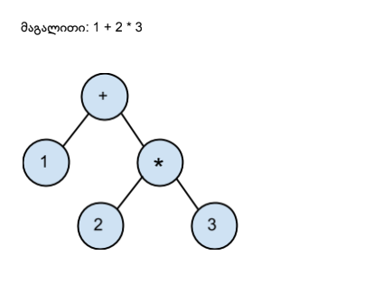

## 1. პოლიმორფიზმი

არითმეტიკული გამოსახულება წარმოადგინეთ ხის სახით და შექმენით მონაცემთა სტრუქტურა ხის წვეროების შესანახად.

თითოეულ კვანძს ჰქონდეს მინიმუმ ორი მეთოდი:

- `double evaluate()` - დააბრუნოს გამოთვლილი მნიშვნელობა კვანძისთვის
- `String toString()` - დააბრუნოს სტრიქონის სახით ჩაწერილი გამოსახულება გამოთვლის გარეშე, ფრჩხილებიც დასვას. სტრიქონი უნდა მოიცავდეს კვანძის ქვეხეში არსებულ სხვა გამოსახულებებსაც, მაგალითად (1 + (2 \* 3))

დააიმპლემენტირეთ 3 სხვადასხვა გზით:
1. 1 კვანძით + switch operator
2. კვანძის ინტერფეისის გამოყენებით (და არანაირი if/else + switch)
3. აბსტრაქტული Operation კლასის დამატებით, რომელიც აიმპლემენტირებს კვანძის ინტერფეისს

## 2. Swing UI (მარტივი მაგალითი)

დახატეთ ღილაკი და ლეიბლი რომელზეც ეწერება რამდენჯერ დაეჭირა ღილაკს.